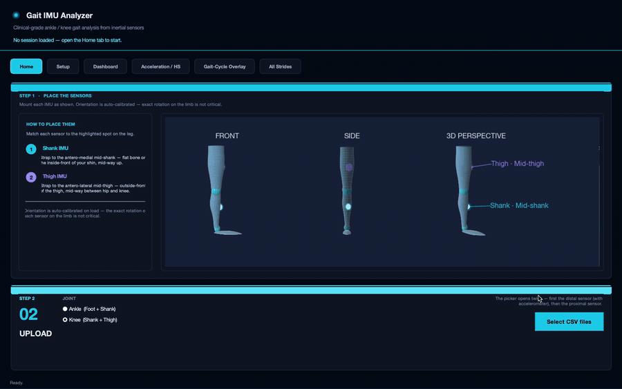
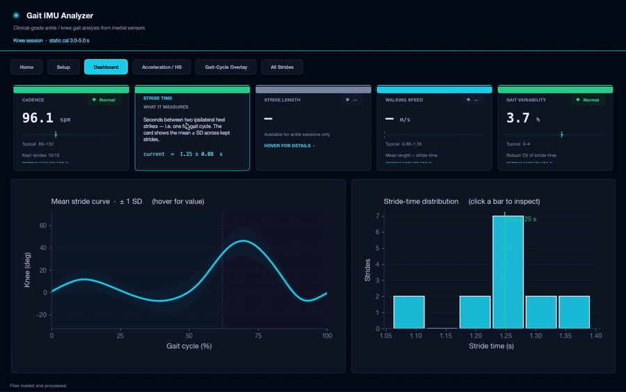
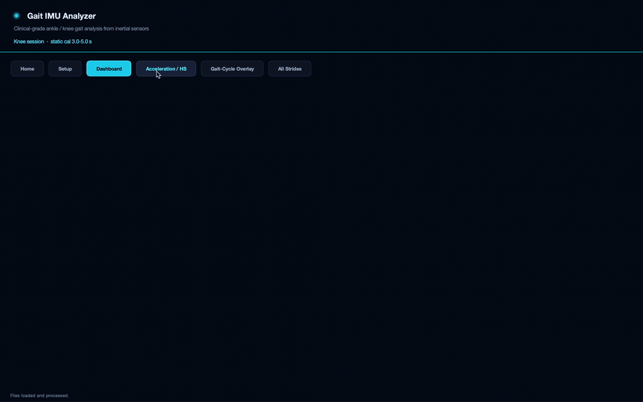
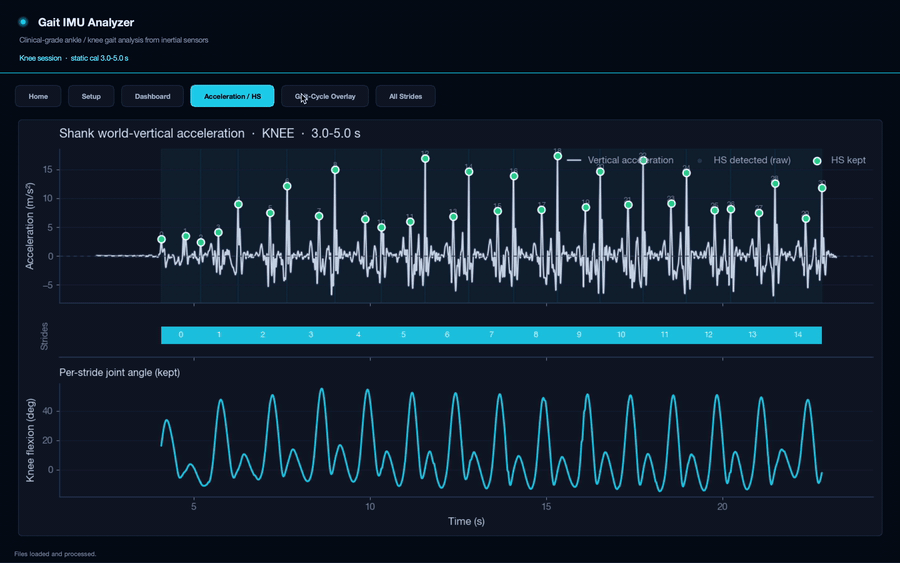

# Gait IMU Analyzer

Gait dysfunction is a hallmark of many neuromuscular and
musculoskeletal conditions, including cerebral palsy, stroke,
muscular dystrophy, spina bifida, and lower-limb trauma. 3D motion
capture has been the gold standard for studying gait, but requires
a specialised lab, expensive equipment, and trained personnel,
making it impractical for frequent use, especially in young
children.

Inertial measurement units (IMUs) have emerged as a promising
alternative. The central question is whether a minimal IMU
configuration can reproduce MoCap-quality joint angles with
sufficient accuracy and repeatability for clinical interpretation.

## Install

Requires **Python ≥ 3.9** on macOS, Linux, or Windows.

```bash
git clone https://github.com/kalamity0513/gait-imu-analyzer.git
cd gait-imu-analyzer

python -m venv .venv
source .venv/bin/activate          # Windows: .venv\Scripts\activate

pip install -e .
```

macOS Homebrew users: if `python -m tkinter` fails, run
`brew install python-tk`.

Launch:

```bash
gait-imu
```

Demo data is bundled under `data/`:

- `Subject1_A1/` for an ankle session
- `Subject1_K1/` for a knee session

## Walkthrough

A guided tour using the bundled knee session.

### Step 1. Place the sensors and upload data



The Home tab opens with two steps. Step 1 shows three views of the
leg with each IMU position marked: front, side, and 3D perspective.
Step 2 lets you pick the joint (Ankle or Knee) and upload the two
CSV files. The picker requests the distal sensor first (foot for
ankle, shank for knee), then the proximal sensor (shank or thigh).

### Step 2. Read the Dashboard



Once the data is processed, the Dashboard summarises the session
as five metric tiles: cadence, stride time, stride length, walking
speed, and gait variability. Each tile carries a status pill
(Normal, Watch, Atypical) computed against healthy-adult ranges,
plus the typical range and a brief explanation on hover. The two
panels below the tiles show the mean ± SD stride curve and the
stride-time histogram across kept strides.

### Step 3. Navigate between views



The pill tab bar at the top routes between Home, Setup, Dashboard,
Acceleration / HS, Gait-Cycle Overlay, and All Strides. Each view
operates on the same loaded session, so switching tabs does not
reload or recompute.

### Step 4. Inspect heel-strike detection



The Acceleration / HS view is the verification surface for the
heel-strike detector. The top panel shows smoothed world-vertical
acceleration with detected heel-strike peaks marked. The middle
rail numbers each stride between consecutive heel strikes. The
bottom panel shows the per-stride joint angle aligned to the same
time axis, so detected strikes can be confirmed against plausible
kinematic events.

## Validation

Against Vicon optical motion capture, healthy adult level walking:

| Joint          | RMSE  | Pearson *r* | CCC   |
| -------------- | ----- | ----------- | ----- |
| Ankle (DF/PF)  | 2.89° | 0.974       | 0.966 |
| Knee (flexion) | 2.18° | 0.994       | high  |

A two-IMU configuration estimates sagittal ankle and knee angles
within ~3° of MoCap, with high concordance across strides.

## Code layout

```
gait-imu-analyzer/
├── data/                          bundled demo IMU sessions
├── docs/                          demo gifs
├── src/gait_imu/
│   ├── __main__.py                console entry point
│   ├── config.py                  tunable signal/calibration thresholds
│   ├── theme.py                   palette, mpl rcParams, ttk styling
│   ├── io_utils.py                CSV ingest with column auto-detection
│   ├── signal_utils.py            filters, robust stats, ZUPT integration
│   ├── calibration.py             functional anatomical calibration
│   ├── clinical_reference.py      normative ranges, gait-phase definitions
│   ├── export.py                  CSV export of session results
│   ├── gait/
│   │   ├── ankle.py               foot + shank to ankle pipeline
│   │   ├── knee.py                shank + thigh to knee pipeline
│   │   └── stride.py              heel-strike pairing, resampling, results
│   └── ui/
│       ├── app.py                 IMUApp, header, tab orchestration
│       ├── widgets.py             Card, FlipCard, MetricTile, PillTabBar
│       ├── sensor_diagram.py      3-view anatomical leg + IMU pucks
│       └── plots.py               figure builders
└── pyproject.toml
```

### Layering

Pipeline modules (`gait/`, `calibration.py`, `signal_utils.py`,
`io_utils.py`) are pure Python with no Tk imports. UI modules
(`ui/*`) call into them. Pipeline modules must not import from
`ui/`. This keeps the pipeline usable from notebooks and batch
scripts.

### Configurable parameters

All signal-processing thresholds live in `src/gait_imu/config.py`
as module-level constants (heel-strike gating, smoothing windows,
resampling resolution, calibration auto-window heuristics).
Override at runtime by importing `config` and reassigning before
calling the pipeline.


### Run the pipeline programmatically

No UI required:

```python
from gait_imu.gait import process_files_ankle, build_outputs_from_pairs
from gait_imu.export import export_session

base = process_files_ankle(
    "data/Subject1_A1/Subject1_A1_Foot.csv",
    "data/Subject1_A1/Subject1_A1_Shank.csv",
    ankle_mode="dfpf",
)
results = build_outputs_from_pairs(base)
export_session(results, "exports/subject1.csv")
```

For knee analyses, swap in
`process_files_knee(shank_csv, thigh_csv)`.

## CSV format

One row per IMU sample. Columns are auto-detected:

| Quantity     | Recognised column names                                              |
| ------------ | -------------------------------------------------------------------- |
| Time         | `time_s`, `time`, `timestamp`, `t`, `sec`, `seconds`                 |
| Quaternion   | `qx, qy, qz, qr` (or `qw`); also `Q*`, `Quat_*` variants             |
| Acceleration | `ax, ay, az` (m/s²); also `acc_x`, `accelerometer_x`, `acc_x_mss`    |

The distal CSV (foot for ankle, shank for knee) needs quaternion
and accelerometer columns. The proximal CSV (shank or thigh) needs
quaternions only. To support a new column alias, edit `io_utils.py`.

## Citation

K. Jijith. *Validating IMU-Derived Joint Kinematics for Pediatric
Gait Analysis.* Honours thesis, School of Biomedical Engineering,
The University of Sydney, 2025.

## License

MIT. See [LICENSE](LICENSE).
