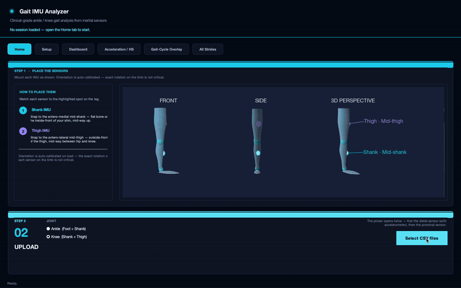

# Gait IMU Analyzer

A desktop tool that computes ankle and knee joint angles from a
minimal two-IMU configuration, and lets the operator review and
curate the resulting strides.



This README is the developer manual. It covers what the project does,
how the code is organised, how to run it, and where to extend it.

## Problem

Gait dysfunction is a hallmark of many neuromuscular and
musculoskeletal conditions, including cerebral palsy, stroke,
muscular dystrophy, spina bifida, and lower-limb trauma. 3D motion
capture has been the gold standard for studying gait, but requires
a specialised lab, expensive equipment, and trained personnel,
making it impractical for frequent use, especially in young
children.

Inertial measurement units (IMUs) have emerged as a promising
alternative. The central question is whether a minimal IMU
configuration can reproduce MoCap-quality joint angles with
sufficient accuracy and repeatability for clinical interpretation.

## What the tool does

An interactive IMU visualiser that streamlines the analysis
workflow by enabling efficient review of raw and processed signals,
stride selection, and automated generation of plots.

The pipeline:

1. Reads two synchronised IMU streams (foot + shank for ankle;
   shank + thigh for knee).
2. Performs functional sensor-to-segment calibration, so precise
   mounting is not required.
3. Detects heel strikes from world-vertical acceleration.
4. Segments the recording into strides between consecutive heel
   strikes.
5. Reports a mean ± SD joint-angle curve over the gait cycle, plus
   cadence, stride time, stride length, and walking speed.
6. Allows individual strides to be kept or dropped from the average.

### Validation

Against Vicon optical motion capture, healthy adult level walking:

| Joint          | RMSE  | Pearson *r* | CCC   |
| -------------- | ----- | ----------- | ----- |
| Ankle (DF/PF)  | 2.89° | 0.974       | 0.966 |
| Knee (flexion) | 2.18° | 0.994       | high  |

A two-IMU configuration estimates sagittal ankle and knee angles
within ~3° of MoCap, with high concordance across strides.

## Install

Requires **Python ≥ 3.9** on macOS, Linux, or Windows.

```bash
git clone https://github.com/kalamity0513/gait-imu-analyzer.git
cd gait-imu-analyzer

python -m venv .venv
source .venv/bin/activate          # Windows: .venv\Scripts\activate

pip install -e .
```

macOS Homebrew users: if `python -m tkinter` fails, run
`brew install python-tk`.

## Run

```bash
gait-imu
```

Demo data is bundled under `data/`:

- `Subject1_A1/` for an ankle session
- `Subject1_K1/` for a knee session

## Code layout

```
gait-imu-analyzer/
├── data/                          bundled demo IMU sessions
├── src/gait_imu/
│   ├── __main__.py                console entry point
│   ├── config.py                  tunable signal/calibration thresholds
│   ├── theme.py                   palette, mpl rcParams, ttk styling
│   ├── io_utils.py                CSV ingest with column auto-detection
│   ├── signal_utils.py            filters, robust stats, ZUPT integration
│   ├── calibration.py             functional anatomical calibration
│   ├── clinical_reference.py      normative ranges, gait-phase definitions
│   ├── export.py                  CSV export of session results
│   ├── gait/
│   │   ├── ankle.py               foot + shank to ankle pipeline
│   │   ├── knee.py                shank + thigh to knee pipeline
│   │   └── stride.py              heel-strike pairing, resampling, results
│   └── ui/
│       ├── app.py                 IMUApp, header, tab orchestration
│       ├── widgets.py             Card, FlipCard, MetricTile, PillTabBar
│       ├── sensor_diagram.py      3-view anatomical leg + IMU pucks
│       └── plots.py               figure builders
└── pyproject.toml
```

### Layering

Pipeline modules (`gait/`, `calibration.py`, `signal_utils.py`,
`io_utils.py`) are pure Python with no Tk imports. UI modules
(`ui/*`) call into them. Pipeline modules must not import from
`ui/`. This keeps the pipeline usable from notebooks and batch
scripts.

### Configurable parameters

All signal-processing thresholds live in `src/gait_imu/config.py`
as module-level constants (heel-strike gating, smoothing windows,
resampling resolution, calibration auto-window heuristics).
Override at runtime by importing `config` and reassigning before
calling the pipeline.

## Extending the project

### Add a new joint or angle method

1. Create `src/gait_imu/gait/<joint>.py` with a
   `process_files_<joint>` function returning the same `base` dict
   shape as `ankle.py`.
2. Re-export it from `gait/__init__.py`.
3. In `ui/app.py`, add the joint to the Step 2 picker and route
   the file-load handler to your new function.

Downstream stride and metrics code is joint-agnostic and works
unchanged.

### Add a new metric to the Dashboard

1. Compute it inside `build_outputs_from_pairs` in
   `gait/stride.py`.
2. Add a normative range entry to `clinical_reference.py`.
3. Mount a `MetricTile` (see `ui/widgets.py`) on the Dashboard tab
   in `ui/app.py`.

### Add a new figure or tab

Figure builders in `ui/plots.py` follow the signature
`build_<name>_figure(results) -> matplotlib.figure.Figure`. Add
yours there, then mount it as a tab in `ui/app.py` using the
existing `PillTabBar` pattern.

### Run the pipeline programmatically

No UI required:

```python
from gait_imu.gait import process_files_ankle, build_outputs_from_pairs
from gait_imu.export import export_session

base = process_files_ankle(
    "data/Subject1_A1/Subject1_A1_Foot.csv",
    "data/Subject1_A1/Subject1_A1_Shank.csv",
    ankle_mode="dfpf",
)
results = build_outputs_from_pairs(base)
export_session(results, "exports/subject1.csv")
```

For knee analyses, swap in
`process_files_knee(shank_csv, thigh_csv)`.

## CSV format

One row per IMU sample. Columns are auto-detected:

| Quantity     | Recognised column names                                              |
| ------------ | -------------------------------------------------------------------- |
| Time         | `time_s`, `time`, `timestamp`, `t`, `sec`, `seconds`                 |
| Quaternion   | `qx, qy, qz, qr` (or `qw`); also `Q*`, `Quat_*` variants             |
| Acceleration | `ax, ay, az` (m/s²); also `acc_x`, `accelerometer_x`, `acc_x_mss`    |

The distal CSV (foot for ankle, shank for knee) needs quaternion
and accelerometer columns. The proximal CSV (shank or thigh) needs
quaternions only. To support a new column alias, edit `io_utils.py`.

## Citation

K. Jijith. *Validating IMU-Derived Joint Kinematics for Pediatric
Gait Analysis.* Honours thesis, School of Biomedical Engineering,
The University of Sydney, 2025.

## License

MIT. See [LICENSE](LICENSE).
