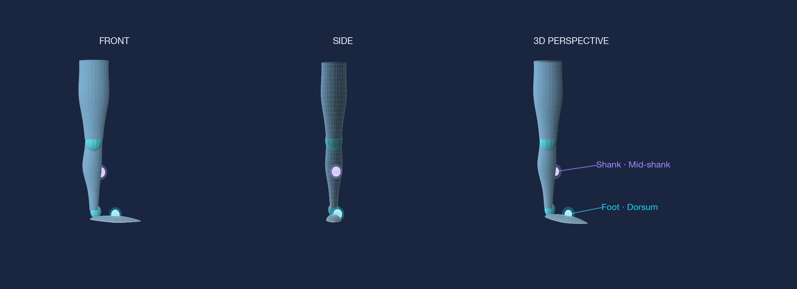
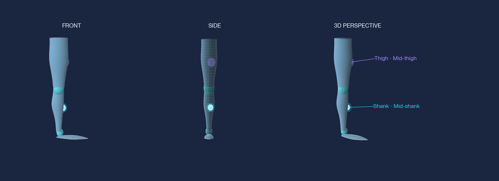
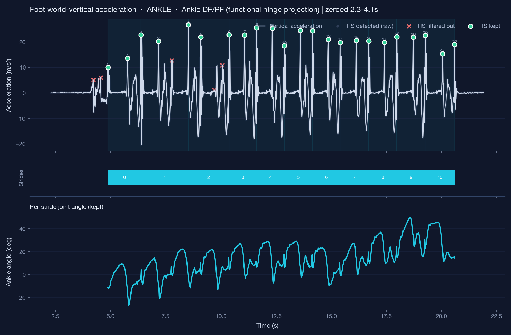
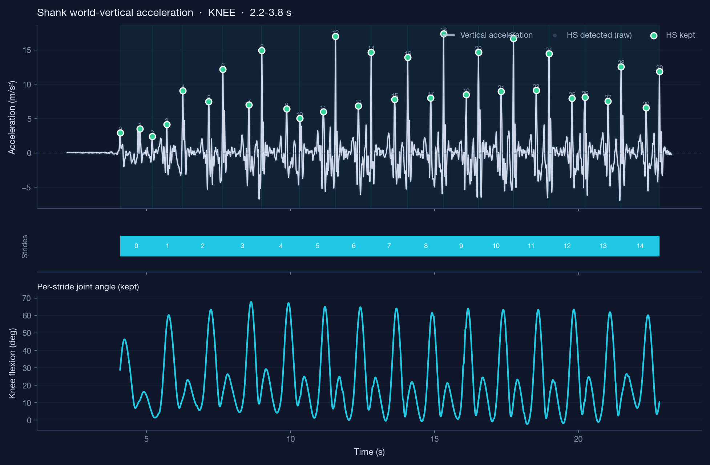
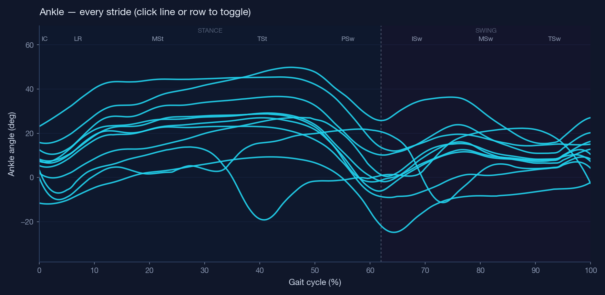
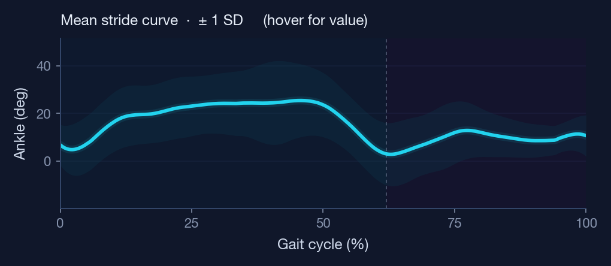
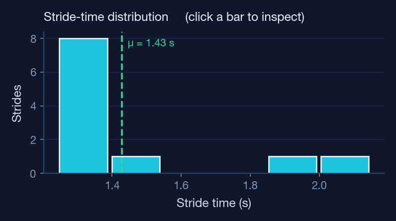

# Gait IMU Analyzer — Developer Manual

An interactive desktop tool for ankle and knee gait analysis from a
minimal two-IMU configuration. Built as the visualisation and stride-
curation layer for the Honours thesis *Validating IMU-Derived Joint
Kinematics for Pediatric Gait Analysis* (K. Jijith, University of
Sydney, 2025).

This document is the manual a new developer needs to pick the project
up: **why it exists, how the pipeline is wired, how to run it, and
where to extend it.** Section 1 covers motivation and the validation
context. Sections 2–4 are the developer-facing parts: install, code
map, signal pipeline. Section 5 is the UI tour with screenshots.
Section 6 covers extension points.

---

## 1. Why this tool exists

3D motion-capture labs are the clinical gold standard for measuring
joint kinematics, but they need a dedicated room, multiple cameras,
trained operators, and a cooperative subject who is willing to wear
markers and walk in a straight line. That is rarely realistic for the
populations who most need gait assessment — small children, patients
recovering from surgery, neurological conditions like cerebral palsy.

Inertial measurement units (IMUs) are small, wireless, and cheap, and
in principle any clinic can deploy them. The open question for the
underlying thesis was a **validation** one:

> The central question is whether a minimal IMU configuration can
> reproduce MoCap-quality joint angles with sufficient accuracy and
> repeatability for clinical interpretation. — *Abstract*

The thesis answered this for adult level walking with two-IMU ankle
and knee setups (RMSE ≈ 2–3°, Pearson *r* ≥ 0.97, CCC ≥ 0.96 vs.
Vicon). To get there, the author needed a **review and curation tool**
that streamlined the cycle of *load → calibrate → detect heel strikes
→ segment strides → drop bad strides → recompute → export*.

This repository is that tool. It is not a full clinical product — it
is a research-grade workbench with a deliberately small surface area
so the experimental loop stays fast and reproducible.

---

## 2. Install and run

Requires **Python ≥ 3.9** on macOS, Linux, or Windows.

```bash
git clone https://github.com/kalamity0513/gait-imu-analyzer.git
cd gait-imu-analyzer

python -m venv .venv
source .venv/bin/activate          # Windows: .venv\Scripts\activate

pip install -e .                   # editable install — code edits take effect immediately
```

> **macOS — Tkinter.** The UI uses Tkinter, which ships with the
> python.org installer but is **not** included with Homebrew Python.
> If `python -m tkinter` raises an error, install
> `brew install python-tk@3.12` (match your Python minor version).

Launch the app:

```bash
gait-imu                # console-script entry point
# or, equivalent:
python -m gait_imu
```

The app window opens on the **Home** tab. Drive through:
*Home → Step 1 (placement) → Step 2 (joint + CSV upload) →
Acceleration / HS → Gait-Cycle Overlay → All Strides →
Dashboard → Setup / Export*.

For headless / batch use the pipelines are pure functions — see
section 6.4.

---

## 3. Code map

```
gait-imu-analyzer/
├── data/                            demo sessions (Subject1_A1, Subject1_K1)
├── docs/screenshots/                UI screenshots (regenerated by scripts/)
├── scripts/
│   └── generate_screenshots.py      headless mpl renderer for README images
├── src/gait_imu/
│   ├── __main__.py                  console entry — calls ui.app.IMUApp().mainloop()
│   ├── config.py                    tunable signal/calibration thresholds
│   ├── theme.py                     palette, mpl rcParams, ttk styling
│   ├── clinical_reference.py        normative ranges + gait-phase definitions
│   ├── io_utils.py                  CSV ingest + column auto-detection
│   ├── signal_utils.py              filters, robust stats, ZUPT integration
│   ├── calibration.py               functional anatomical calibration
│   ├── gait/
│   │   ├── ankle.py                 foot + shank → ankle pipeline
│   │   ├── knee.py                  shank + thigh → knee pipeline
│   │   └── stride.py                HS pairing, resampling, results assembly
│   ├── export.py                    CSV export of session results
│   └── ui/
│       ├── app.py                   IMUApp — header, tab orchestration, state
│       ├── widgets.py               Card / FlipCard / MetricTile / PillTabBar
│       ├── sensor_diagram.py        3-view anatomical leg + IMU pucks
│       └── plots.py                 figure builders (phase shading, normative bands)
├── pyproject.toml
└── README.md
```

### Module sizes (rough)

| Layer       | Files                                  | LOC    |
| ----------- | -------------------------------------- | ------ |
| Pipeline    | `gait/`, `calibration.py`, `signal_*`  | ~700   |
| UI          | `ui/app.py`, `widgets.py`, `plots.py`  | ~2300  |
| Reference   | `clinical_reference.py`, `theme.py`    | ~440   |

Almost all UI complexity lives in `ui/app.py`. The pipeline modules
are small and intentionally pure (input → numpy/dict output, no
global state, no Tk imports).

### Layering rule

```
ui/  ──► gait/, export, calibration, clinical_reference, theme
gait/ ──► calibration, signal_utils, io_utils, config
```

Pipeline modules **must not** import from `ui/`. UI modules call into
pipeline modules and never the other way. Keep it that way — the
pipelines are also exercised from notebooks and the screenshot script.

---

## 4. Signal pipeline

For an ankle session: foot CSV (distal, with quaternions + accel) and
shank CSV (proximal, quaternions only). For a knee session: shank
(distal) and thigh (proximal). Same skeleton applies to both.

```
                  ┌──────────────┐
   Foot CSV  ───► │  io_utils    │ ─── load_csv() → time + quat + accel arrays
                  └──────┬───────┘
   Shank CSV ───►        │
                         ▼
                  ┌──────────────┐    standing window → vertical axis
                  │ calibration  │    flexion window  → hinge axis
                  │              │    triad → R_anat_to_sensor (per sensor)
                  └──────┬───────┘
                         ▼
                  ┌──────────────┐
                  │ gait/ankle   │    project quaternions into anatomical frame,
                  │  or knee     │    compute sagittal joint angle θ(t)
                  └──────┬───────┘
                         ▼
                  ┌──────────────┐    smooth distal world-vertical accel
                  │ HS detection │    peaks gated by max(global, local) k·σ
                  │ (signal_utils)│   → t_HS array
                  └──────┬───────┘
                         ▼
                  ┌──────────────┐    consecutive HS pairs → strides
                  │ gait/stride  │    resample θ to N_RESAMPLE points (0–100 % gait)
                  │              │    Sav-Gol smooth, mean ± SD ensemble
                  └──────┬───────┘    spatiotemporal metrics (cadence, stride length …)
                         ▼
                  results dict ──►  ui/plots.py figure builders
                              └──►  export.py CSV writer
```

### 4.1 Calibration (`calibration.py`)

Functional, not anatomical-marker based. Two short windows:
- **Standing still** — gravity vector ⇒ each sensor's vertical axis.
- **Flexion** — principal rotation between the two sensors ⇒ the
  joint hinge axis.

A right-handed triad (vertical + hinge → forward) is built and
projected back into each sensor frame. Output: per-sensor
`R_anat_to_sensor`, used for the rest of the trial.

The user can either let the app auto-pick those windows from the
"near-zero acceleration" heuristic in `config.py`
(`ZERO_TOL_MSS`, `ZERO_MIN_LEN_S`) or set them manually on the
**Setup** tab.

### 4.2 Joint angle (`gait/ankle.py`, `gait/knee.py`)

Both modules expose `process_files_*(distal_csv, proximal_csv,
ankle_mode=...)` returning a `base` dict with calibrated angles plus
the inputs the heel-strike + stride stages need.

- **Ankle** has two modes:
  - `dfpf` (default) — sagittal dorsiflexion / plantarflexion from
    the projected anatomical-frame quaternions.
  - `so3` — full SO(3) decomposition; useful for sanity checks.
- **Knee** is sagittal flexion only; abduction/adduction is reported
  but not used in the validation chapter.

### 4.3 Heel-strike detection (`signal_utils.py`)

Smoothed (`ACC_SMOOTH_S` moving mean) world-vertical acceleration
of the distal sensor. Candidate peaks pass a SciPy `find_peaks` call;
they are then **gated** by

```
height ≥ max( HEIGHT_K_GLOBAL · σ_global,
              HEIGHT_K_LOCAL  · σ_local(LOCAL_WIN_S) )
```

with a minimum spacing of `MIN_HS_SEP_S`. All thresholds live in
`config.py`. The Acceleration / HS tab visualises the three peak
sets — *candidates*, *rejected*, *retained* — so the operator can see
exactly why a peak was kept or dropped.

### 4.4 Strides + ensemble (`gait/stride.py`)

`make_pairs(t_HS)` yields consecutive HS pairs. For each pair the
joint-angle slice is resampled to `N_RESAMPLE = 300` points and
smoothed with a Savitzky–Golay filter
(`SAVGOL_WIN`, `SAVGOL_POLY`). `build_outputs_from_pairs(base)`
returns the full results dict (ensemble mean ± SD, individual
strides, metrics, kept/dropped masks, raw arrays for plots).

Stride length and walking speed come from per-stride trapezoidal
integration of distal acceleration with linear-drift correction
(*v* end forced to zero), then position; mean stride length / mean
stride time. Reported on the Dashboard.

### 4.5 Configurable parameters

All pipeline thresholds are module-level constants in
`src/gait_imu/config.py`. Override at runtime by importing and
reassigning before calling the pipeline:

```python
from gait_imu import config
config.HEIGHT_K_GLOBAL = 3.2     # stricter HS detection
```

There is no env-var or CLI plumbing for these on purpose — they
are research knobs, not user settings.

---

## 5. UI tour

The screenshots below are regenerated by
`scripts/generate_screenshots.py` from the bundled demo sessions.
The Home tab and pill tab bar are GUI-only and live in
`ui/app.py` + `ui/widgets.py`.

### 5.1 Home — placement + upload

Two-step onboarding.

**Step 1** — three views of the anatomical leg with IMU pucks marked
(front, side, 3D perspective), alongside a numbered placement panel.
The numbered list calls out the puck colour, the IMU name (Foot /
Shank / Thigh) and the body landmark (e.g. *dorsum, just past the
laces*).

| Ankle placement | Knee placement |
| --------------- | -------------- |
|  |  |

**Step 2** — joint pick (*Ankle / Knee*), angle method
(*Functional DF/PF* or *SO(3)* for ankle), and CSV upload. The app
auto-detects which of the two CSVs is distal vs. proximal by
inspecting available columns.

### 5.2 Acceleration / HS

Used to verify heel-strike detection and to choose the starting peak
for stride segmentation.

- **Top panel** — smoothed vertical acceleration with detected heel
  strikes; candidate peaks, rejected peaks, and retained peaks are
  colour-coded.
- **Middle rail** — HS-to-HS stride segments over absolute time.
- **Lower panel** — joint angle segments aligned to the same timebase.

| Ankle session | Knee session |
| ------------- | ------------ |
|  |  |

### 5.3 Gait-Cycle Overlay

Every kept stride normalised to 0–100 % gait, plus the ensemble mean
± SD. Used to inspect whether the IMU-derived kinematics show the
expected stance/swing features and to compare calibration choices.
A lilac healthy-adult reference band can be overlaid for visual
comparison.

| Ankle DF/PF | Knee flexion |
| ----------- | ------------ |
|  |  |

### 5.4 All Strides

Each line is a single stride. Click a curve or its legend entry to
toggle whether that stride is kept for averaging and metric
computation. This is the curation interface — used to drop first
steps, turns, and obvious artefacts in a transparent way.

| Ankle | Knee |
| ----- | ---- |
|  |  |

### 5.5 Dashboard

Compact "clinical" tiles for cadence, stride time, stride length,
walking speed, and gait variability, plus the mean ± SD overlay and
a stride-time histogram. Each tile carries a status pill
(*Normal / Watch / Atypical*) computed against the healthy-adult
ranges in `clinical_reference.py`.

| Mean ± SD overlay | Stride-time histogram |
| ----------------- | --------------------- |
|  |  |

### 5.6 Setup / Export

Manual calibration windows (standing / flexion / ankle-zero), stride
trimming, and CSV export of *overlay*, *all-strides*, *kept-strides*,
and *metrics* tables.

---

## 6. Extending the project

This section is the "where do I plug in?" map for a new developer.

### 6.1 Add a new joint or angle method

1. Create `src/gait_imu/gait/<joint>.py` with a `process_files_<joint>`
   function that returns the same `base` dict shape as `ankle.py`
   (fields: `time`, `angle`, `t_HS`, `accel_world_vertical`, etc.).
2. Re-export it from `gait/__init__.py`.
3. In `ui/app.py`, add the joint to the Step 2 picker and route
   the file-load handler to your new function.

The downstream stride + ensemble + metrics + plots code is
joint-agnostic and works as-is.

### 6.2 Add a new metric to the Dashboard

1. Compute the metric inside `gait/stride.py`
   (`build_outputs_from_pairs`) so it is part of the `results` dict.
2. Add a normative range entry to `clinical_reference.py`.
3. In `ui/app.py` extend the Dashboard tile row by adding a
   `MetricTile(...)` (see `widgets.py` for the API). Tiles take a
   value, units, status pill, and reference-range bar.

### 6.3 Add a new figure / tab

Figure builders live in `ui/plots.py` and follow a uniform shape:
`build_<name>_figure(results) -> matplotlib.figure.Figure`. Add yours
there, then mount it in `ui/app.py` via the existing `PillTabBar`
pattern (`_build_*_tab` methods).

If you want the figure in the README screenshots, add a `save(...)`
call to `scripts/generate_screenshots.py`.

### 6.4 Run the pipeline programmatically

Pure functions — no UI required.

```python
from gait_imu.gait import process_files_ankle, build_outputs_from_pairs
from gait_imu.export import export_session

base = process_files_ankle(
    "data/Subject1_A1/Subject1_A1_Foot.csv",
    "data/Subject1_A1/Subject1_A1_Shank.csv",
    ankle_mode="dfpf",
)
results = build_outputs_from_pairs(base)

# results["overlay"]   - mean ± SD ensemble
# results["strides"]   - per-stride normalised curves
# results["metrics"]   - cadence, stride time, stride length, …

export_session(results, "exports/subject1.csv")
```

For knee, swap in `process_files_knee(shank_csv, thigh_csv)`.

### 6.5 Regenerate README screenshots

After changing any plot in `ui/plots.py` or the sensor diagram:

```bash
python scripts/generate_screenshots.py
```

Writes 12 PNGs into `docs/screenshots/`. The script uses the
matplotlib `Agg` backend so it does not need a display server.
GUI-only screens (Home, pill tabs) cannot be produced this way —
capture those from a running app and drop them in as
`docs/screenshots/app_*.png`.

---

## 7. CSV format

One row per IMU sample. Columns are auto-detected — recognised
aliases:

| Quantity     | Recognised column names                                              |
| ------------ | -------------------------------------------------------------------- |
| Time         | `time_s`, `time`, `timestamp`, `t`, `sec`, `seconds`                 |
| Quaternion   | `qx, qy, qz, qr` (or `qw`); also any `Q*` / `Quat_*` variant         |
| Acceleration | `ax, ay, az` (m/s²); also `acc_x`, `accelerometer_x`, `acc_x_mss`, … |

The **distal** CSV (foot for ankle, shank for knee) needs quaternion
**and** accelerometer columns. The **proximal** CSV (shank or thigh)
needs quaternions only.

If your raw export uses a column name not in the alias list, add it
to `io_utils.py` rather than renaming columns by hand.

---

## 8. Bundled demo data

> **Demo data only.** The two sessions in `data/` ship with the repo
> purely so you can try the pipeline end-to-end without recording
> your own IMU streams. They are **not** the cohort recordings used
> for the thesis validation, and the numbers reported by the app on
> these files should be treated as illustrative.

| Folder              | Joint | Files to load                                                |
| ------------------- | ----- | ------------------------------------------------------------ |
| `data/Subject1_A1/` | Ankle | `Subject1_A1_Foot.csv`, `Subject1_A1_Shank.csv`              |
| `data/Subject1_K1/` | Knee  | `Subject1_K1_Shank.csv`, `Subject1_K1_Thigh.csv`             |

---

## 9. Validation summary (from the thesis)

Reported in Chapter 5 of the underlying thesis. Vicon Blue Trident
IMUs were recorded concurrently with optical motion capture during
healthy adult level walking:

| Joint           | RMSE  | MAE   | Bias                | Pearson *r* | CCC      |
| --------------- | ----- | ----- | ------------------- | ----------- | -------- |
| Ankle (DF/PF)   | 2.89° | 2.23° | +1.39°              | 0.974       | 0.966    |
| Knee (flexion)  | 2.18° | —     | ≈ 0° (95 % CI ± 0.43°) | 0.994       | very high |

> Taken together, these findings demonstrate that a two-IMU
> configuration can estimate sagittal ankle and knee angles within
> ~3° of MoCap with high concordance across strides. — *Abstract*

---

## 10. Citation

If you use this tool in academic work, please cite the underlying
thesis:

> Jijith, K. (2025). *Validating IMU-Derived Joint Kinematics for
> Pediatric Gait Analysis.* Bachelor of Biomedical Engineering
> (Honours) thesis, School of Biomedical Engineering, The University
> of Sydney.

---

## License

MIT — see [LICENSE](LICENSE).
