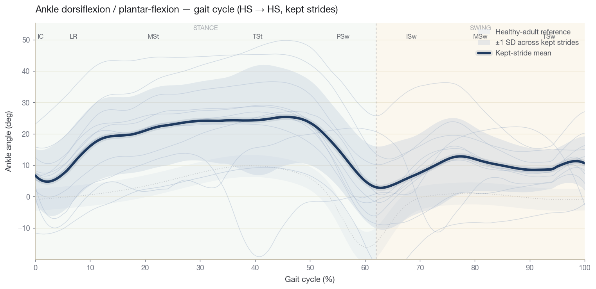
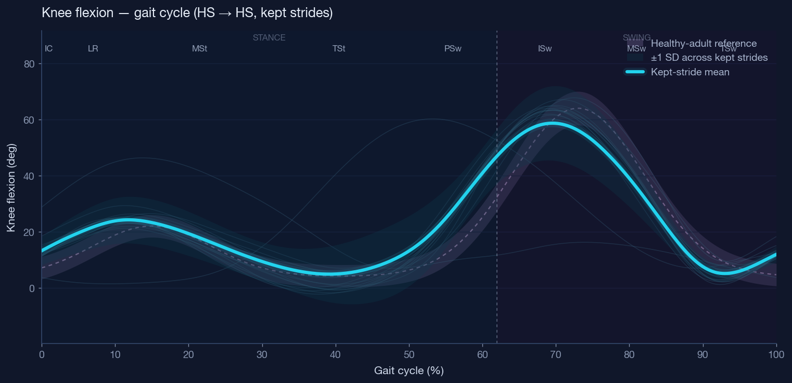
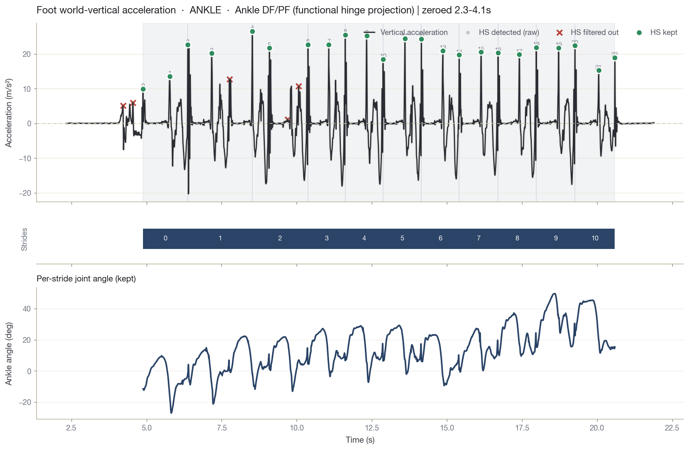
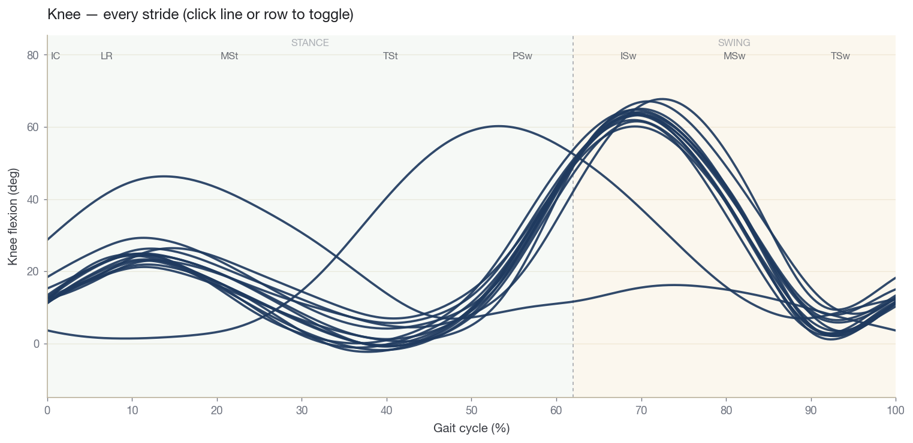

# Gait IMU Analyzer

A clinical desktop app for **ankle and knee gait analysis from
inertial measurement units (IMUs)**, with orientation-agnostic
functional calibration and an interactive workflow for stride
curation.

Built around two paired IMUs:

- **Ankle** : Foot + Shank → ankle dorsi/plantar-flexion (or |SO(3)|)
- **Knee**  : Shank + Thigh → knee flexion

The pipeline auto-detects heel strikes, segments strides
(HS → HS), reports clinical metrics (cadence, stride time/length,
walking speed, gait variability), and lets the clinician keep or
drop individual strides before the mean ± SD curve is computed.


> The animated demo above walks through Home → Dashboard → All
> Strides on the bundled `Subject1_A1` ankle session. See
> [Recording the demo](#recording-the-demo) for how to regenerate
> it.

---

## Highlights

- **Dark, futuristic clinical UI** — deep ink-navy background, electric
  cyan / soft-violet accents, rounded **flip cards** (front: metric &
  status pill; back: plain-language description), reference-range bars,
  and custom pill tabs.
- **Guided onboarding** — the **Home** tab walks the user through
  *Step 1 — placement* (numbered instructions next to a 3-view
  anatomical leg diagram with the IMU pucks marked) and
  *Step 2 — upload* (joint pick + Select CSV).
- **Gait-cycle aware plots** — every overlay plot ships with
  **stance / swing shading**, gait-phase chips (IC, LR, MSt, TSt, PSw,
  ISw, MSw, TSw), an optional **healthy-adult reference band**, and
  individual stride traces behind the mean ± SD curve.
- **Functional calibration** — no fixed sensor mounting required.
  A standing-still window estimates each sensor's vertical axis, and
  a flexion window estimates the joint hinge axis from the principal
  rotation between the two sensors. Both are inferred automatically
  from the data when possible.
- **Robust HS detection** — peak finding on the world-vertical
  acceleration with combined local + global gating, all driven by
  robust (MAD-based) statistics.
- **Stride-length & speed** — per-stride trapezoidal integration of
  horizontal world acceleration with a linear ZUPT-like drift
  correction. Walking speed = mean stride length / mean stride time.
- **Vendor-agnostic CSV ingest** — column names are fuzzy-matched, so
  `qx`, `Quat_X`, `acc_x_mss`, `Time_s`, `timestamp`, etc. all work.

---

## Clinical reference cues

Each headline metric on the dashboard ships with a healthy-adult
level-walking reference range (visible as a coloured bar under the
value) and a **status pill**:

| Pill | Meaning |
| ---- | ------- |
| Normal   | within the typical band |
| Watch    | inside the acceptable band but outside *typical* |
| Atypical | outside the acceptable band |
| —        | not enough data yet |

The interpretation panel translates the same signals into plain
language. Reference values are screening cues, not diagnostic
thresholds — see `src/gait_imu/clinical_reference.py` for sources.

---

## Screenshots

The plot images below are produced from the bundled sample sessions
(`data/Subject1_*`).

| Ankle gait-cycle overlay (with phase shading + reference band) |
| -------------------------------------------------------------- |
|            |

| Knee gait-cycle overlay |
| ----------------------- |
|  |

| Acceleration & heel-strike detection (3 aligned rows) |
| ----------------------------------------------------- |
|     |

| All strides (interactive — click a curve to keep / drop it) |
| ----------------------------------------------------------- |
|  |

To capture the live app for `docs/screenshots/app_*.png`, run the
app, load a session, then on macOS `Shift + Cmd + 4` → `Space` →
click the window.

---

## Install

Requires **Python ≥ 3.9**.

```bash
git clone https://github.com/your-username/gait-imu-analyzer.git
cd gait-imu-analyzer

python -m venv .venv
source .venv/bin/activate          # Windows: .venv\Scripts\activate

pip install -e .
```

(Equivalent: `pip install -r requirements.txt` if you prefer not to
install the package itself.)

> **Note for macOS**: the app uses Tkinter, which ships with the
> python.org installer but is **not** included in some Homebrew
> Pythons. If `python -m tkinter` fails, install
> `brew install python-tk`.

### Run

```bash
gait-imu                # console-script entry point
# or
python -m gait_imu      # equivalent
```

---

## Quick demo with the bundled data

Two sessions ship with the repo under `data/`:

| Folder            | Joint | Files to load                                                          |
| ----------------- | ----- | ---------------------------------------------------------------------- |
| `data/Subject1_A1/` | Ankle | Foot CSV: `Subject1_A1_Foot.csv` &nbsp; Shank CSV: `Subject1_A1_Shank.csv` |
| `data/Subject1_K1/` | Knee  | Shank CSV: `Subject1_K1_Shank.csv` &nbsp; Thigh CSV: `Subject1_K1_Thigh.csv` |

### Walk-through (Ankle session)

1. Launch the app → `gait-imu`.
2. **Home → Step 1** — read the placement panel and check the 3-view
   anatomical diagram. Mount the **Foot IMU** on the dorsum (top of
   foot, just past the laces) and the **Shank IMU** on the
   antero-medial mid-shank.
3. **Home → Step 2** — pick **Ankle (Foot + Shank)** and the
   **Functional DF/PF** angle method, then press **Select CSV files**.
4. Pick `data/Subject1_A1/Subject1_A1_Foot.csv` then
   `data/Subject1_A1/Subject1_A1_Shank.csv`.
5. The app auto-infers a standing-still window from near-zero
   foot-vertical acceleration and pre-fills both **Standing** and
   **Ankle zero** windows on the **Setup** tab.
6. Inspect, via the pill tabs at the top of the window:
   - **Dashboard** — five flip cards (cadence, stride time, stride
     length, walking speed, variability), each with a status pill and
     a reference-range bar. Hover any card to flip it and read the
     plain-language description. Below: a mean ± SD overlay and a
     stride-time histogram.
   - **Acceleration / HS** — top: vertical accel + heel-strike markers
     (raw / filtered / kept). Middle: stride rail. Bottom: per-stride
     ankle angle traces in absolute time, all aligned on the same
     x-axis.
   - **Gait-Cycle Overlay** — angle vs % gait with **stance / swing
     shading**, gait-phase chips, mean ± 1 SD across kept strides, and
     an optional lilac healthy-adult **reference band**.
   - **All Strides** — every stride drawn individually; click a line
     or double-click a row to toggle "keep". Press **Recompute from
     kept** to update the overlay and metrics.
7. From the **Setup** tab → **Export CSV** writes four files
   (`*_overlay.csv`, `*_strides_all.csv`, `*_strides_kept.csv`,
   `*_metrics.csv`).

### Expected numbers (Subject1_A1 with default windows)

```
mode                        : ankle
HS detected raw / kept      : 28 / 23
Stride pairs (HS → HS)      : 11
Cadence                     : ~84 spm
Walking speed               : ~0.85 m/s
Calibration note            : Ankle DF/PF (functional hinge projection) | zeroed 2.3-4.1 s
```

### Walk-through (Knee session)

Same flow, but choose **Knee (Shank + Thigh)** and load
`data/Subject1_K1/Subject1_K1_Shank.csv` then
`data/Subject1_K1/Subject1_K1_Thigh.csv`. Expected: ~31 HS detected,
~15 stride pairs, ~96 spm cadence.

---

## Programmatic use

The pipelines are pure functions — call them from a notebook or batch
script without touching the UI.

```python
from gait_imu.gait import process_files_ankle, build_outputs_from_pairs
from gait_imu.export import export_session

base = process_files_ankle(
    "data/Subject1_A1/Subject1_A1_Foot.csv",
    "data/Subject1_A1/Subject1_A1_Shank.csv",
    ankle_mode="dfpf",          # or "so3"
)
res = build_outputs_from_pairs(base)

print(res["cadence_spm"], res["speed_ms"], len(res["pairs_all"]))

export_session(res, "exports/subject1.csv")
```

For knee:

```python
from gait_imu.gait import process_files_knee, build_outputs_from_pairs

base = process_files_knee(
    "data/Subject1_K1/Subject1_K1_Shank.csv",
    "data/Subject1_K1/Subject1_K1_Thigh.csv",
)
res = build_outputs_from_pairs(base)
```

---

## CSV format

Each input CSV is one row per IMU sample. Columns are auto-detected;
recognised aliases include:

| Quantity     | Recognised column names                                              |
| ------------ | -------------------------------------------------------------------- |
| Time         | `time_s`, `time`, `timestamp`, `t`, `sec`, `seconds`                 |
| Quaternion   | `qx, qy, qz, qr` (or `qw`); plus any `Q*` / `Quat_*` variant         |
| Acceleration | `ax, ay, az` (m/s²); also `acc_x`, `accelerometer_x`, `acc_x_mss`, … |

Foot / Shank-with-accel CSVs need quaternion **and** accelerometer.
Shank/Thigh-quat-only CSVs can omit the accel columns (the app uses
quaternions alone for the second sensor).

---

## Project layout

```
gait-imu-analyzer/
├── data/                   sample sessions (Subject1_A1, Subject1_K1)
├── docs/screenshots/       UI screenshots referenced from this README
├── src/gait_imu/
│   ├── config.py               tunable signal/calibration parameters
│   ├── theme.py                clinical palette, typography, mpl defaults
│   ├── clinical_reference.py   normative ranges, gait-cycle phases, interpretation
│   ├── io_utils.py             CSV ingest + column auto-detection
│   ├── signal_utils.py         filters, robust stats, ZUPT integration
│   ├── calibration.py          functional anatomical calibration
│   ├── gait/
│   │   ├── ankle.py            Foot+Shank → ankle pipeline
│   │   ├── knee.py             Shank+Thigh → knee pipeline
│   │   └── stride.py           HS pairing, curve resampling, results
│   ├── export.py               CSV export of session results
│   └── ui/
│       ├── widgets.py          ttk styles + Card / FlipCard / MetricTile / PillTabBar
│       ├── sensor_diagram.py   3-view anatomical leg + IMU pucks (matplotlib 3D)
│       ├── plots.py            figure builders (phase shading, normative bands)
│       └── app.py              IMUApp: header + pill-tab orchestration
├── pyproject.toml
├── requirements.txt
├── LICENSE
└── README.md
```

---

## Method notes (short)

- **Calibration (`calibration.auto_pair_A2S`)**
  Estimates the world-vertical axis as seen by each sensor (mean
  rotation in a *standing* window) and the joint hinge axis in world
  frame (PCA-style on relative rotation vectors during a *flexion*
  window, or the whole trial if no window given). A right-handed
  triad (vertical + hinge → forward) is built and projected back into
  each sensor frame to obtain `A2S`, the per-sensor anatomical-to-
  sensor rotation.

- **Heel strike (`gait.ankle.process_files_ankle`)**
  Vertical world acceleration is smoothed (moving mean) and peaks are
  found with `scipy.signal.find_peaks`, then gated by the larger of a
  global threshold (k × robust std over the whole trial) and a local
  threshold (k × local rolling std over `LOCAL_WIN_S`).

- **Stride length (`signal_utils.integrate_stride_xy_linear_zupt`)**
  Per-stride trapezoidal velocity, then linear-drift correction
  forcing v(t_end) = 0, then trapezoidal position. Walking speed =
  mean stride length / mean stride time.

All thresholds live in `src/gait_imu/config.py` and can be tuned
without editing the pipelines.

---

## Recording the demo

`docs/screenshots/demo.gif` is a short walk-through of the app on the
bundled ankle session. To re-record it on macOS:

1. **Capture** with `Cmd + Shift + 5` → *Record Selected Portion* →
   draw a rectangle around the app window → *Record*. Drive through
   `Home → Dashboard → All Strides`, then stop. The result lands on
   the Desktop as a `.mov`.
2. **Convert to GIF** with [`ffmpeg`](https://ffmpeg.org/) (one-liner,
   ~12 fps, 960 px wide):

   ```bash
   ffmpeg -i ~/Desktop/demo.mov \
          -vf "fps=12,scale=960:-1:flags=lanczos" \
          -loop 0 docs/screenshots/demo.gif
   ```

   For a smaller file size, drop fps to 8 and pass through
   `gifsicle -O3` afterwards.
3. Commit the regenerated GIF:

   ```bash
   git add docs/screenshots/demo.gif
   git commit -m "docs: refresh demo gif"
   ```

The README references it from the top of the file, so any update
flows through automatically.

---

## Roadmap

- Per-stride spatial-temporal table view
- Symmetry indices (left/right pairs)
- Optional `pyproject` extras: `[full]` for plotting, `[dev]` for tests
- Headless batch CLI (`gait-imu batch <folder>`)

---

## License

MIT — see [LICENSE](LICENSE).
